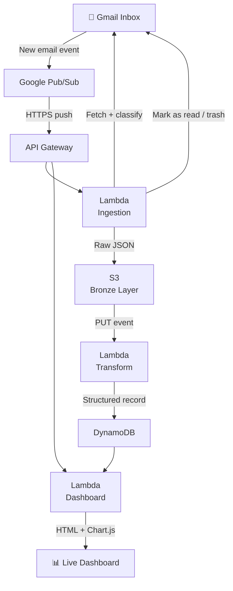

# Gmail → AWS Transaction Pipeline

A production-grade, fully serverless event-driven data pipeline that
automatically captures bank transaction emails the moment they arrive in
Gmail, parses them, stores them in the cloud, and serves a live financial
dashboard — with zero manual intervention after setup.

Built as a complete overhaul of a manual local script into a proper
data engineering system on AWS.

---

## What it does

- **Listens in real time** — Gmail pushes a notification the instant a
  transaction email arrives. No polling, no cron jobs.
- **Classifies automatically** — separates transaction alerts from login
  notifications and marketing. Trashes login noise, marks transactions
  as read.
- **Stores raw + structured** — raw email JSON lands in S3 (audit trail),
  parsed fields land in DynamoDB (queryable).
- **Serves a live dashboard** — a serverless single-page app with spending
  trends, balance history, and transaction breakdown.
- **Scales to zero** — costs nothing when idle. The entire pipeline runs
  on AWS free tier for personal transaction volumes.

---

## Architecture



---

## Tech stack

| Layer | Technology |
|---|---|
| Language | Python 3.12 |
| Package management | uv |
| Infrastructure as code | Terraform |
| Email trigger | Google Cloud Pub/Sub + Gmail Watch API |
| Compute | AWS Lambda (x3 functions) |
| API layer | Amazon API Gateway HTTP API |
| Raw storage | Amazon S3 (lifecycle tiering to Glacier) |
| Structured storage | Amazon DynamoDB (serverless, PAY_PER_REQUEST) |
| Secrets | SSM Parameter Store |
| Observability | Amazon CloudWatch Logs |
| Dashboard | Serverless HTML + Chart.js served by Lambda |

---

## Pipeline stages

### Stage 1 — Ingestion Lambda
Triggered by a Pub/Sub push from Gmail. Loads OAuth credentials from
SSM parameter store, calls the Gmail History API to fetch new messages,
classifies each email, writes raw JSON to S3, and marks transactions
as read.

### Stage 2 — Transform Lambda
Triggered by the S3 PUT event. Reads the raw email JSON, parses the
bank-specific fields (amount, type, description, reference, balance)
from the subject line and plain-text body, and writes a structured
record to DynamoDB.

### Stage 3 — Dashboard Lambda
Serves a single-page HTML dashboard on `GET /dashboard` and aggregated
JSON on `GET /api/data`. Reads directly from DynamoDB and computes
monthly aggregates, balance trends, and spending breakdowns at request
time.

---

## Dashboard

A live, mobile-responsive financial dashboard showing:

- **4 KPI cards** — total credits, total debits, net flow, current balance
- **Monthly bar chart** — credits vs debits side by side per month
- **Balance trend** — available balance over the last 90 days
- **Spending breakdown** — top debit categories as a horizontal bar chart
- **Recent transactions** — last 20 transactions with type badges

---

## Project structure
```bash
gmail-transaction-pipeline/
├── lambdas/
│   ├── ingestion/      # Gmail fetch, classify, S3 write
│   ├── transform/      # Email parser, DynamoDB writer
│   └── dashboard/      # HTML dashboard + data API
├── terraform/          # All AWS infrastructure
├── scripts/
│   ├── gmail_watch.py          # One-time OAuth + Gmail watch setup
│   ├── full_backfill.py        # Backfill entire Gmail history
│   ├── test_ingestion.py       # Manual Lambda invoke for testing
│   ├── backfill_transform.py   # Re-trigger transform for S3 files
├── ├── deploy.sh               # Mini automation of the build and deploy processes
│   └── build_lambdas.sh        # Cross-platform Lambda packaging
└── .env.example 
```

---

## Setup

### Prerequisites
- Python 3.12+, uv, Terraform 1.6+, AWS CLI v2, Git
- AWS account (free tier sufficient)
- Google Cloud account (free tier sufficient)

### Phases
| Phase | Description |
|---|---|
| 0 | Project foundation — uv workspace, Terraform skeleton |
| 1 | Google Cloud — Pub/Sub topic, Gmail watch, OAuth credentials |
| 2 | AWS infrastructure — Terraform apply (S3, DynamoDB, Lambda, API GW) |
| 3 | Ingestion Lambda — Gmail OAuth, history API, S3 write, email classification |
| 4 | Transform Lambda — email parser, DynamoDB writer |
| 5 | Dashboard — serverless HTML dashboard, Chart.js visualisation |

### Quick start

```bash
# 1. Clone and install
git clone https://github.com/YOUR_USERNAME/gmail-transaction-pipeline
cd gmail-transaction-pipeline
uv sync

# 2. Configure
cp .env.example .env
cp terraform/terraform.tfvars.example terraform/terraform.tfvars
# Edit both files with your values

# 3. Google Cloud setup
uv run scripts/gmail_watch.py

# 4. AWS infrastructure
cd terraform && terraform init && terraform apply

# 5. Build and deploy Lambdas
cd .. && bash scripts/build_lambdas.sh
cd terraform && terraform apply
# N/B This entire stage was later compressed to just running 
bash scripts/deploy.sh

# 6. Backfill history
cd .. && uv run scripts/full_backfill.py

# 7. Open dashboard
cd terraform && terraform output -raw dashboard_url
```

---

## Cost estimate

For personal transaction volumes (< 500 emails/month):

| Service | Cost |
|---|---|
| Lambda | Free (well within 1M free invocations/month) |
| API Gateway | Free (well within 1M free requests/month) |
| S3 | ~$0.01/month |
| DynamoDB | Free (within free tier permanently) |
| SSM Parameter Store | Free (standard parameters) |
| **Total** | **~$0.01/month** |

---

## Planned extensions

- [ ] Crypto market price tracker (P2P NGN rates)
- [ ] CloudWatch alarms for pipeline failures  
- [ ] Multi-bank support
- [ ] Budget alerts via SNS

---

## Author

Built by **Chukwuemeka** — Lagos, Nigeria 🇳🇬

